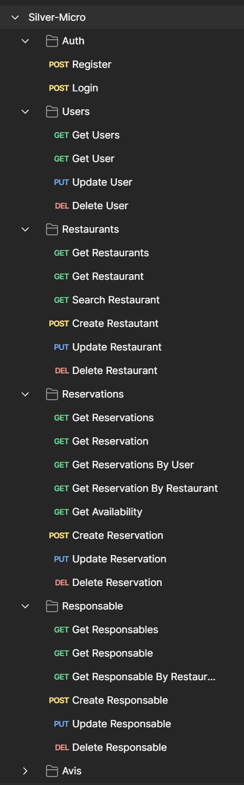

# Silver Micro

## Getting Started

These instructions will get you a copy of the project up and running on your local machine for development and testing purposes.
1. Clone the repository

### Prerequisites

What things you need to install the software and how to install them:

- Node.js
- npm

### Installing

## Backend

A step by step series of examples that tell you how to get a development environment running:

1. Navigate to the frontend directory: `cd Server`.
1. Install dependencies with `npm install`
1. Start the server with `npm start`

> :warning: **Before starting the server, make sure to modify the database name in `src/database.js` to match your local database configuration.**

## Usage

How to use this project:

1. Register a new user by making a POST request to `/api/v1/register` with a username and password.
2. Login with a POST request to `/api/v1/auth` with your username and password. You will receive a JWT token in response.
3. Make authenticated requests to protected routes by including the JWT token in the Authorization header.

## Built With

- [Node.js](https://nodejs.org/) - The web framework used
- [Express](https://expressjs.com/) - Minimalist web framework for Node.js
- [jsonwebtoken](https://www.npmjs.com/package/jsonwebtoken) - Used to create access tokens
- [Sequelize](https://sequelize.org/) - A promise-based Node.js ORM for Postgres, MySQL, MariaDB, SQLite and Microsoft SQL Server.

## Frontend

This is the frontend part of the project, built with Vite, Axios, Tailwind CSS, and Shadcn.

### Prerequisites

Before getting started, make sure you have the following installed:

- Node.js
- npm or yarn

### Installation

Follow these steps to set up the development environment:

1. Clone the repository.
2. Navigate to the frontend directory: `cd Client`.
3. Install dependencies: `npm install` or `yarn install`.

### Configuration

Before running the frontend, you need to configure the API endpoint. Open the `services/config.js` file in the root directory of the frontend and set the `baseURL` variable to the URL of your backend API.

### Development

To start the development server, run the following command:
npm run dev
